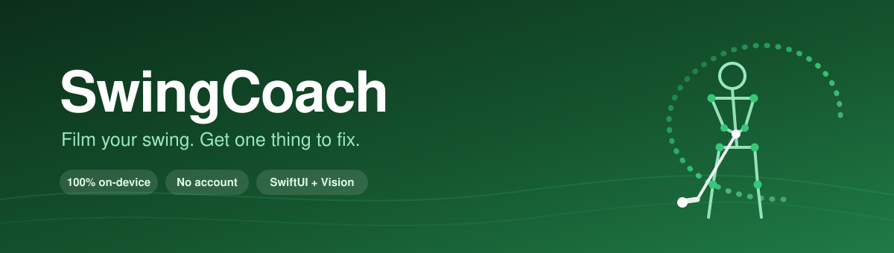
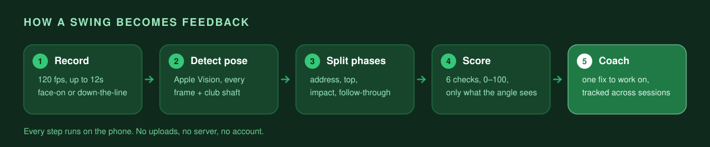

<div align="center">



<br><br>


### Film your golf swing with your iPhone. Get one specific thing to fix.

</div>

---

## What it is

SwingCoach turns a phone video of your golf swing into feedback you can actually act on.

Prop your phone up, record a swing, and the app finds your body in every frame, works out where your backswing ends and your downswing begins, and scores six fundamentals against known-good ranges. Then it does the part that matters: instead of dumping six numbers on you, it picks **the single worst fault** and tells you what to work on.

Everything runs on the phone. No account, no upload, no subscription.

## Why I built it

I'm learning to golf, and like everyone else I ended up with a camera roll full of swing videos.

The problem is that watching them back barely helped. I could tell something looked off, but not *what* — and definitely not whether it was better or worse than last week. The apps I found either wanted a subscription, wanted me to upload video of myself to somebody's server, or gave me a wall of numbers without saying which one to care about.

So this is the tool I wanted: record, get one clear thing to fix, and see whether it's improving. It's a passion project I build on evenings and weekends — equal parts learning golf and learning iOS.

## How it works



Two things it deliberately refuses to do:

- **Guess when it can't see.** If the pose data is too low-confidence or the swing can't be segmented, it says so and asks for a re-record. Confidently wrong feedback is worse than none.
- **Score what the camera can't show.** Hip sway isn't measurable from behind you, so a down-the-line video simply won't report it.

## What it checks

Each check scores 0–100. Which ones run depends on the angle you filmed from.

| Check | What it looks at | Face-on | Down-the-line |
|---|---|:---:|:---:|
| **Setup Posture** | Spine tilt and stance at address | | ✅ |
| **Head Stability** | How much your head drifts during the swing | ✅ | |
| **Hip Sway** | Lateral hip slide vs. rotation | ✅ | |
| **Spine Angle** | Whether you hold your posture through impact | | ✅ |
| **Shoulder Turn** | Rotation at the top of the backswing | ✅ | |
| **Tempo** | Backswing-to-downswing ratio (the classic 3:1) | ✅ | ✅ |

Scores map to three bands — **Good** (70+), **Needs Work** (30–69), **Critical** (under 30) — so the number always matches the words next to it.

## Features

| | |
|---|---|
| 🎥 **120 fps capture** | Slow-motion playback at 0.25x / 0.5x / 1x, or import a clip you already shot |
| 🦴 **Pose overlay** | Skeleton drawn over your swing, with low-confidence joints hidden rather than faked |
| 🏌️ **Club shaft detection** | Estimates shaft angle at address and draws the line on playback |
| ⛳ **Club tracking** | Tag each swing with one of 15 clubs, then filter history and progress by it |
| 📈 **Progress tab** | Per-check trends, a focus area that persists across sessions, and a resettable baseline |
| 🎯 **One fix at a time** | The worst check is surfaced as a single coaching card, not a scoreboard |

## Built with


## Tools I work with

**Languages**


**Frameworks & Libraries**


**Infrastructure & Data**


**Tooling**


## Running it

Requires **Xcode 16+**, **iOS 18+**, and a real device — pose detection needs a camera, and the simulator has no 120 fps format.

```bash
git clone https://github.com/GeorgeFashho/SwingCoach.git
cd SwingCoach
open SwingCoach.xcodeproj
```

Set your own signing team under **Signing & Capabilities**, then build and run to your iPhone.

> **Filming tip:** phone 8–10 feet away at roughly hand height, with your whole body in frame. The app's onboarding walks through both angles.

## Project structure

```
SwingCoach/
├── Models/          SwiftData models + domain enums
├── Services/        The engine room — pose, segmentation, analysis, coaching
│   └── Checks/      One file per biomechanical check
├── ViewModels/      Capture, playback, progress
├── Views/           SwiftUI screens by feature
├── DesignSystem/    Spacing, radius, color, and type tokens
└── Utilities/       Angle math, smoothing, and all tunable thresholds
```

The analysis layer (`AnalysisEngine`, `CoachingEngine`, the checks, segmentation) is pure and SwiftData-free, which is why it can be tested against synthetic swing fixtures — **156 tests across 31 suites**. Every threshold lives in `Utilities/Constants.swift` rather than scattered through the code.

## Privacy

Videos, pose data, and results never leave the device. They live in the app's own Documents directory, and deleting a swing deletes its video and pose file with it. No analytics, no account, and no network layer in the app at all.

---

<div align="center">
<sub>A passion project by <a href="https://github.com/GeorgeFashho">George Fashho</a> — built on evenings and weekends.</sub>
</div>
